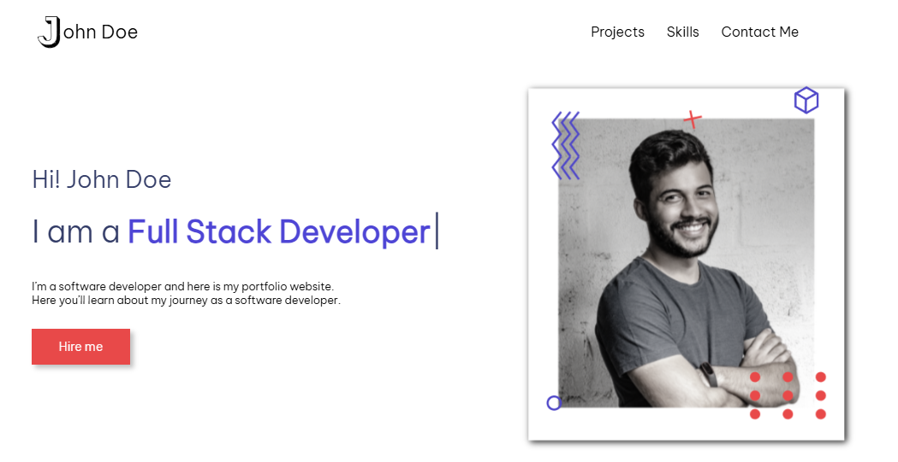
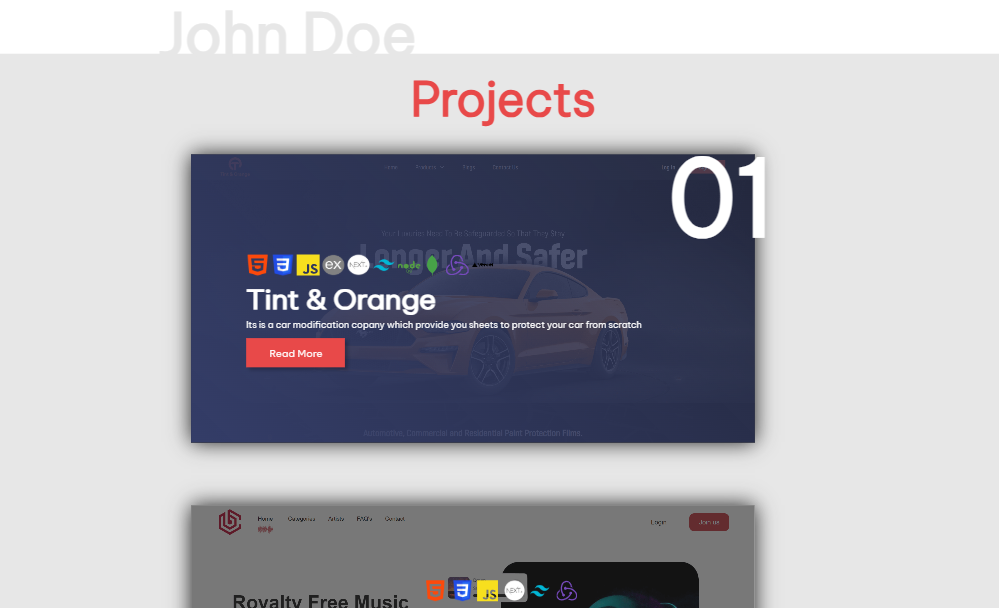
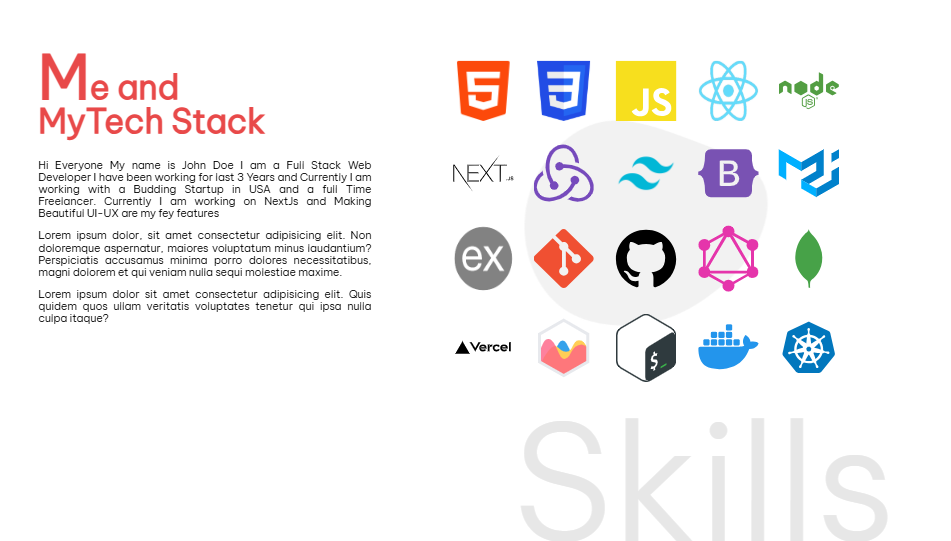
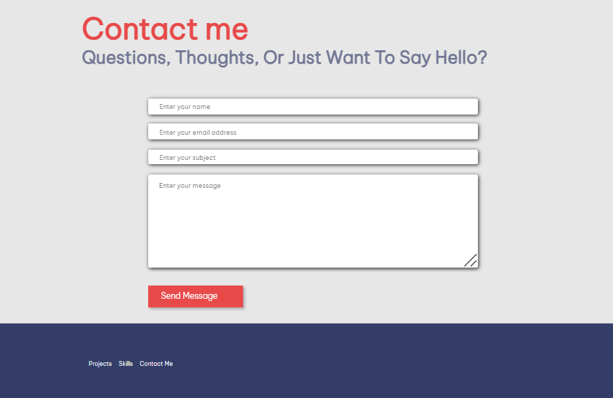

## Portfolio 

Welcome to the **Portfolio Project**, a vibrant and interactive web interface that not only showcases my work but also reflects my journey as a web developer. Built using **HTML**, **CSS**, and a touch of **JavaScript**, this project highlights my creativity, skills, and dedication to crafting beautiful user interfaces.

## Features

- **Introduction Section**: A warm welcome and a brief introduction about an individual as a developer.

- **Project Showcase**: An elegant section displaying projects individual have worked on.

- **Skills Highlight**: A beautifully designed area to showcase the technologies and tools individual proficient in.

- **Contact Form**: A form to connect with individual easily.

## Technologies Used

- **HTML:** For creating the structure of the webpage.
- **CSS:** For styling the page and enhancing visual appeal.
-**JavaScript**: To add interactivity and enhance the user experience.

### Screenshots

=======
